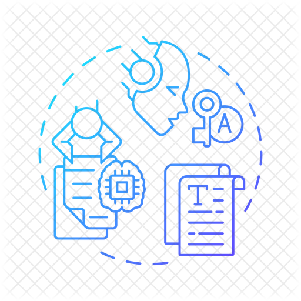

   <table>
      <tr>
       <th>Profile stats  </th>
       <th>Language Contribution</th>
     </tr>
      <tr>
       <td> </td>
       <td> </td>
   </table>

<h3>My coding stack: </h3>

  
  
   
   
  
  
  
  
  
  
  
  
  
   

<h3>Databases </h3>

<h3>Contacts </h3>

    
    

<h3>Statistics </h3>

 

